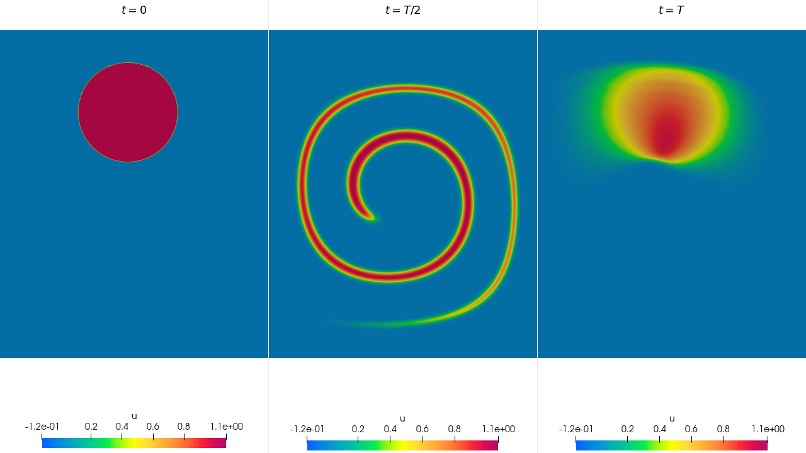

# Benchmark: Disk Stretching
The disk stretching problem, also known as the single vortex or vortex-in-a-box problem, was first introduced by Bell et al (1989). Advection schemes are evaluated using an analytical stretching flow field applied in a disk, generating thin filaments with a given velocity field. It begins with a bidimensional squared domain size of [0, 1] X [0, 1] where a disk with a radius of 0.15 is positioned at (0.5, 0.75). The velocity field causes the disk to stretch and distort until it becomes very thin, forming a curl. To analyze errors, LeVeque (1996) recommended multiplying the velocity field by a another function. That function allows the fluid to return to its original state within a time period T.

## Methodology
- Transient problem
- Equation type: Diffusion-Advection-Reaction equation
  $\quad \quad$ $
  \begin{cases}
    \begin{aligned}
    \frac{\partial u}{\partial t} + \mathbf{v} \nabla u - \nabla \cdot (\kappa \nabla u) = s \quad &\text{ in } \Omega \times ]0, T_f] \\
    u( \: \cdot \: , 0) = u_0 \quad &\text{ in } \Omega\\
    u = u_D \quad &\text{ in } \Gamma_D \\
    \mathbf{v}(\mathbf{n} \cdot \nabla)u = h \quad &\text{ in } \Gamma_N 
    \end{aligned}
    \end{cases}
 $
- Problem dimension: 2D

## Discussions
Because of the stiffness of the problem, it is necessary to apply stabilizers to be able to find the solution with less oscilations. It is used stabilizers such as YZβ (Bazilevs et al, 2007), SUPG (Brooks & Hughes, 1982) and CAU (Alvarez H., 2004).

## Results
Benchmark result with QUAD4 elements for timestep $0$, $T/2$ and $T$, the last one.
Mesh: [disk_quad4.msh](msh/benchmark_disc_stretching/disk_quad4.msh)
Parameters:
- $\mathbf{v} = (\sin(2\pi y)\sin^2(\pi x), -\sin(2\pi x)\sin^2(\pi y))$
- $k = 10^{-8}$
- $T_f = T = 8$
- $s = 0$
- $u_0 = u_0(x,y) = (x - 0.5)^2 + (y - 0.75)^2$ = 1
- $u_D = 0$
- $\Gamma_N = \empty$
  

## References
- Alvarez Henao, C. Um Estudo sobre Operadores de Captura de Descontinuidades para Problemas de Transporte Advectivos. PhD thesis, 04 2004.
- Bazilevs, Y., Calo, V. M., Tezduyar, T. E., & Hughes, T. J. (2007). YZβ discontinuity capturing for advection‐dominated processes with application to arterial drug delivery. International Journal for Numerical Methods in Fluids, 54(6‐8), 593-608.
- Bell, J. B., Colella, P., and Glaz, H. M. A second-order projection method for the incompressible navier-stokes equations. Journal of computational physics 85, 2 (1989), 257–283.
- Brooks, A. N., & Hughes, T. J. (1982). Streamline upwind/Petrov-Galerkin formulations for convection dominated flows with particular emphasis on the incompressible Navier-Stokes equations. Computer
methods in applied mechanics and engineering, 32(1-3), 199-259.
- Camata, J. J., HENAO, C., and COUTINHO, A. Reduced integration with hourglass stailization for bi-linear quadrlilateral elements in libmesh. In V National Congress in Mechanical Engineering (2008).
- Leveque, R. J. High-resolution conservative algorithms for advection in incompressible flow. SIAM Journal on Numerical Analysis 33, 2 (1996), 627–665.