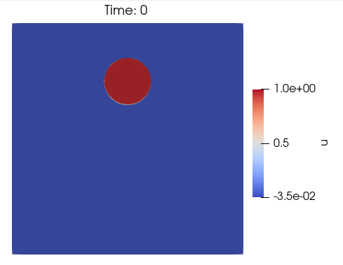
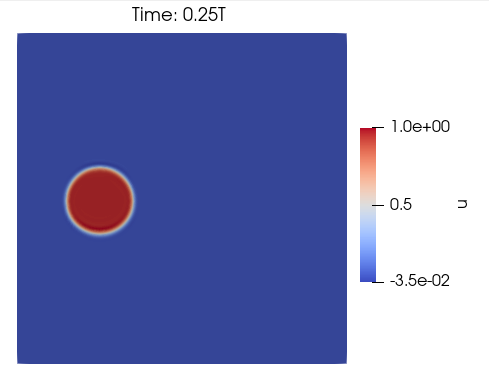
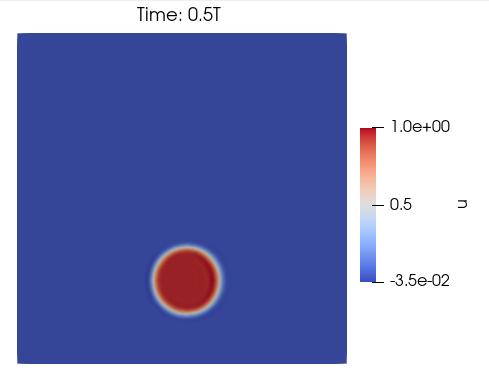
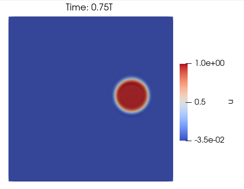
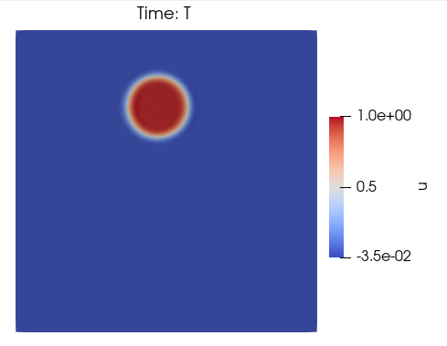

# Benchmark: Rotation Coin
A initial condition in a coin format is rotated around the center of the domain. It begins with a bidimensional squared domain size of [0, 1] X [0, 1] where a coin with a radius of 0.15 is positioned at (0.5, 0.75). The velocity field rotates the coin around the center of the domain.

## Methodology
- Transient problem
- Equation type: Diffusion-Advection-Reaction equation
$\quad \quad$ $
  \begin{cases}
    \begin{aligned}
    \frac{\partial u}{\partial t} + \mathbf{v} \nabla u - \nabla \cdot (\kappa \nabla u) = s \quad &\text{ in } \Omega \times ]0, T_f] \\
    u( \: \cdot \: , 0) = u_0 \quad &\text{ in } \Omega\\
    u = u_D \quad &\text{ in } \Gamma_D \\
    \mathbf{v}(\mathbf{n} \cdot \nabla)u = h \quad &\text{ in } \Gamma_N 
    \end{aligned}
    \end{cases}
 $
- Problem dimension: 2D

## Discussions
Because of the stiffness of the problem, it is necessary to apply stabilizers to be able to find the solution with less oscilations. It is used stabilizers such as SUPG (Brooks & Hughes, 1982) and CAU (Alvarez H., 2004).

## Results
Benchmark result with QUAD4 elements for timestep $0$, $0.25T$, $0.5T$, $0.75T$ and $T$, the last one with $\Delta T = 0.005$
Mesh: [benchmark_coin_quad4.msh](msh/benchmark_rotation_coin/benchmark_coin_quad4.msh)
Parameters: 
- $\mathbf{v} = (-y + 0.5, x - 0.5)$
- $k = 10^{-5}$
- $T_f = T = 4$
- $s = 0$
- $u_0 = u_0(x,y) = (x-0.5)^2 + (y-0.75)^2 = 1$
- $u_D = 0$
- $\Gamma_N = \empty$

  
   
  
  
  

## References
- Brooks, A. N., and Hughes, T. J. Streamline upwind/petrov-galerkin formulations for convection dominated flows with particular emphasis on the incompressible navier-stokes equations. Computer methods in applied mechanics and engineering 32,
1-3 (1982), 199–259.
- Alvarez Henao, C. Um Estudo sobre Operadores de Captura de Descontinuidades para Problemas de Transporte Advectivos. PhD thesis, 04 2004.