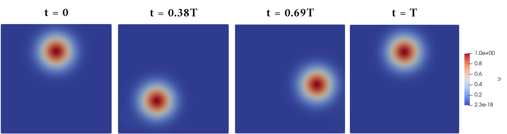

# Benchmark: Rotation Pulse
In rotation Gaussian pulse benchmark, as presented in Valli et al (2015), a Gaussian conical form is centered at (5.0, 7.5) and is advected around the domain center, returning to the initial position in a T period of time. The problem is solved for T = 2*pi. The benchmark domain size is [0, 10] X [0, 10]. 

## Methodology
- Transient problem
- Equation type: Diffusion-Advection-Reaction equation
  $\quad \quad$ $
  \begin{cases}
    \begin{aligned}
    \frac{\partial u}{\partial t} + \mathbf{v} \nabla u - \nabla \cdot (\kappa \nabla u) = s \quad &\text{ in } \Omega \times ]0, T_f] \\
    u( \: \cdot \: , 0) = u_0 \quad &\text{ in } \Omega\\
    u = u_D \quad &\text{ in } \Gamma_D \\
    \mathbf{v}(\mathbf{n} \cdot \nabla)u = h \quad &\text{ in } \Gamma_N 
    \end{aligned}
    \end{cases}
 $
- Problem dimension: 2D

## Discussions
Because of the stiffness of the problem, it is necessary to apply stabilizers to be able to find the solution with less oscilations. It is used stabilizers such as SUPG (Brooks & Hughes, 1982) and CAU (Alvarez H., 2004).

## Results
Benchmark result with TRI3 elements for timestep $0$, $0.38T$, $0.69T$ and $T$, the last one with $\Delta T = 0.0025$.
Mesh: [benchmark_rotpulse_quad4.msh](msh/benchmark_rotation_pulse/benchmark_rotpulse_quad4.msh)
Parameters: 
- $\mathbf{v} = (-y + 5.0, x - 5.0)$
- $k = 10^{-8}$
- $T_f = T = 2\pi$
- $s = 0$
- $u_0 = u_0(x,y) = e^{-0.5r}, \quad r = (x-5)^2 + (y-7.5)^2$
- $u_D = 0$
- $\Gamma_N = \empty$

## References
- Alvarez Henao, C. Um Estudo sobre Operadores de Captura de Descontinuidades para Problemas de Transporte Advectivos. PhD thesis, 04 2004.
- Brooks, A. N., and Hughes, T. J. Streamline upwind/petrov-galerkin formulations for convection dominated flows with particular emphasis on the incompressible navier-stokes equations. Computer methods in applied mechanics and engineering 32,
1-3 (1982), 199–259.
- Valli, A. M., Catabriga, L., Santos, I. P., Coutinho, A. A., & Almeida, R. C. (2015). Predictor-
multicorrector scheme for the dynamic diffusion method. Proceeding Series of the Brazilian Society
of Computational and Applied Mathematics, 3(2).