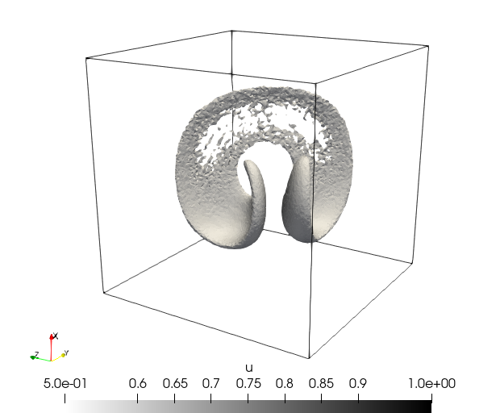
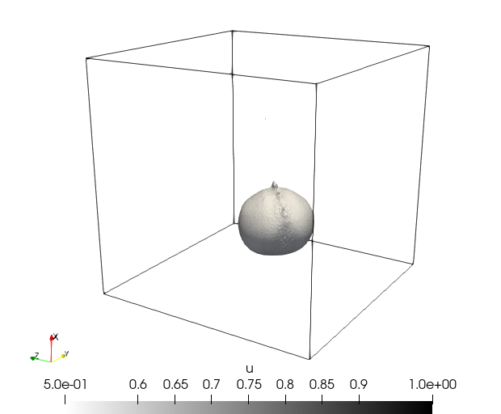

# Benchmark: Sphere Stretching
The sphere stretching problem is equivalent to [Disk Streching Benchmark](benchmark_disk_stretching.md) in tridimensional domain. It has a sphere positioned in the center of the domain. The velocity field causes the sphere to stretch and distort until it becomes very thin, forming a curl in tridimensional space. 

## Methodology
- Transient problem
- Equation type: Diffusion-Advection-Reaction equation
 $\quad \quad$ $
  \begin{cases}
    \begin{aligned}
    \frac{\partial u}{\partial t} + \mathbf{v} \nabla u - \nabla \cdot (\kappa \nabla u) = s \quad &\text{ in } \Omega \times ]0, T_f] \\
    u( \: \cdot \: , 0) = u_0 \quad &\text{ in } \Omega\\
    u = u_D \quad &\text{ in } \Gamma_D \\
    \mathbf{v}(\mathbf{n} \cdot \nabla)u = h \quad &\text{ in } \Gamma_N 
    \end{aligned}
    \end{cases}
 $
- Problem dimension: 3D

## Discussions
Because of the stiffness of the problem, it is necessary to apply stabilizers to be able to find the solution with less oscilations. It is used stabilizers such as SUPG (Brooks & Hughes, 1982) and CAU (Alvarez H., 2004).

## Results
Benchmark result with TET4 elements for timesteps $0$, $T/2$ and $T$, the last one with $\Delta T = 0.01$.
Mesh: [sphere.msh](msh/benchmark_sphere_stretching/sphere.msh)
Parameters:
- $\mathbf{v} = (2\sin^2(\pi x)\sin(2\pi y)\sin(2\pi z), -\sin(2\pi x)\sin^2(\pi y)\sin(2\pi z), -\sin(2\pi x)\sin(2\pi y)\sin^2(\pi z))$
- $k = 10^{-8}$
- $T_f = T = 3$
- $s = 0$
- $u_0 = u_0(x,y) = (x - 0.35)^2 + (y - 0.35)^2 + (z - 0.35)^2$ = 1
- $u_D = 0$
- $\Gamma_N = \empty$

  
   
  

## References
- Alvarez Henao, C. Um Estudo sobre Operadores de Captura de Descontinuidades para Problemas de Transporte Advectivos. PhD thesis, 04 2004.
- Brooks, A. N., and Hughes, T. J. Streamline upwind/petrov-galerkin formulations for convection dominated flows with particular emphasis on the incompressible navier-stokes equations. Computer methods in applied mechanics and engineering 32,
1-3 (1982), 199–259.
- Camata, J., Rossa, A., Valli, A., Catabriga, L., Carey, G., and Coutinho, A. Reordering and incomplete preconditioning in serial and parallel adaptive mesh refinement and coarsening flow solutions. International Journal for Numerical Methods in Fluids 69, 4 (2012), 802–823.
- Valli, A. M., Catabriga, L., Santos, I. P., Coutinho, A. A., & Almeida, R. C. (2015). Predictor-
multicorrector scheme for the dynamic diffusion method. Proceeding Series of the Brazilian Society
of Computational and Applied Mathematics, 3(2).