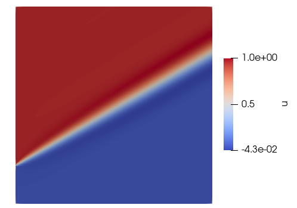

# Benchmark: Convection Diffusion
It applies a simple convection-diffusion problem that was introduced by Brooks and Hughes (1982). In one side of the domain is applied a boundary condition with value 0 and in the other side a boundary condition with value 1. This difference of the boundary condition generates a vertical step form in the middle of the domain.

## Methodology
- Stationary problem
- Equation type: Diffusion-Advection equation
- $\quad \quad$ $
    \begin{cases}
    -\nabla \kappa \nabla u + \mathbf{v}\nabla u& = s   \text{ in } \Omega \\
    u  & = u_D   \text{ in } \Gamma_D \\
    \mathbf{n} \cdot \kappa \nabla u & = h \text{ in } \Gamma_N
    \end{cases}
  $
- Problem dimension: 2D

## Results
Benchmark result with TRI3 elements.
Mesh: [conv2dtri3.msh](msh/convection_difussion_2d/conv2dtri3.msh)
Parameters: 
- $\mathbf{v} = (\frac{\sqrt{3}}{2}, \frac{1}{2})$
- $k = 10^{-8}$
- $s = 0$
- $u_D = 0$
- $\Gamma_N = \empty$

## References
- Brooks, A. N., and Hughes, T. J. Streamline upwind/petrov-galerkin formulations for convection dominated flows with particular emphasis on the incompressible navier-stokes equations. Computer methods in applied mechanics and engineering 32,
1-3 (1982), 199–259.