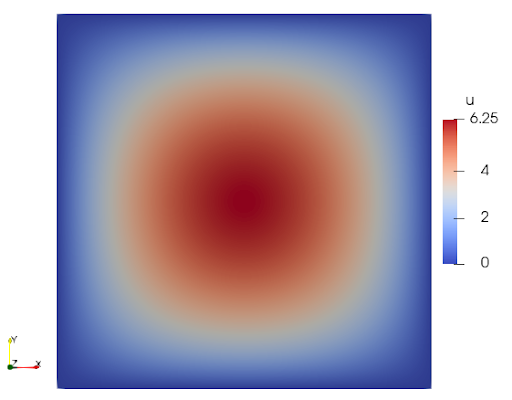

# Benchmark: 2D Poisson
Simple bidimensional Poisson solution. In a squared domain with boundary conditions homogenous it is applied a force in the center of the domain obtaining a sheet form.

## Methodology
- Stationary problem
- Equation type: Poisson equation
  $\quad \quad$ $
    \begin{cases}
    -\kappa \nabla^2 u & = s   \text{ in } \Omega \\
    u  & = u_D   \text{ in } \Gamma_D \\
    \mathbf{n} \cdot \kappa \nabla u & = h \text{ in } \Gamma_N
    \end{cases}
  $

- Problem dimension: 2D

## Results
Poisson 2D result with QUAD4 elements.
Mesh: [poisson.msh](msh/poisson_2d/poisson.msh)
Parameters:
- $s = 200y(y-1) + 200x(x-1)$
- $k = 1.0$
- $u_D = 0$
- $\Gamma_N = \empty$
