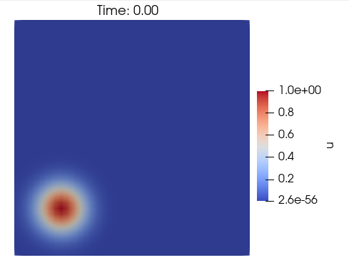
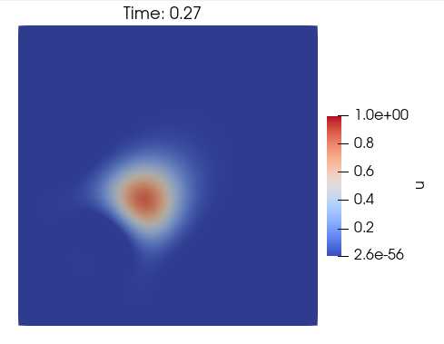
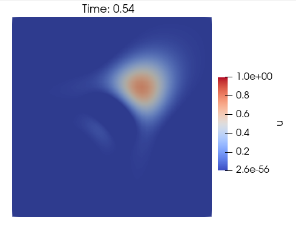
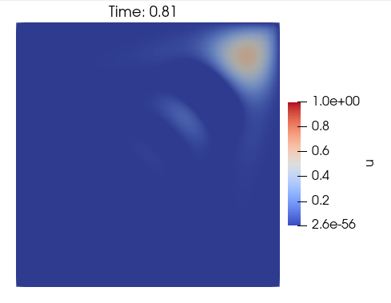
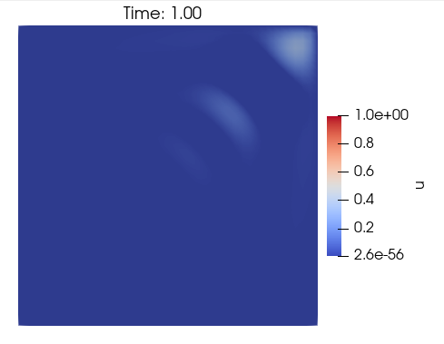

# Benchmark: Transport
In this benchmark, there is a concentration positioned at (0.2, 0.2) as initial condition. This concentration is advected with velocity $\mathbf{v} = (1, 1)$.

## Methodology
- Transient problem
- Equation type: Diffusion-Advection-Reaction equation
$\quad \quad$ $
  \begin{cases}
    \begin{aligned}
    \frac{\partial u}{\partial t} + \mathbf{v} \nabla u - \nabla \cdot (\kappa \nabla u) = s \quad &\text{ in } \Omega \times ]0, T_f] \\
    u( \: \cdot \: , 0) = u_0 \quad &\text{ in } \Omega\\
    u = u_D \quad &\text{ in } \Gamma_D \\
    \mathbf{v}(\mathbf{n} \cdot \nabla)u = h \quad &\text{ in } \Gamma_N 
    \end{aligned}
    \end{cases}
 $
- Problem dimension: 2D

## Discussions
Because of the stiffness of the problem, it is necessary to apply stabilizers to be able to find the solution with less oscilations. It is used stabilizers such as SUPG (Brooks & Hughes, 1982) and CAU (Alvarez H., 2004).

## Results
Benchmark result with TRI3 elements for time $0$, $0.27$, $0.54$, $0.81$ and $1$, the last one with $\Delta T = 0.05$.
Mesh: [transport.msh](msh/transport/transport.msh)
Parameters: 
- $\mathbf{v} = (1, 1)$
- $k = 10^{-4}$
- $T_f = T = 1$
- $s = 0$
- $u_0 = u_0(x,y) = 100e^{(x - 0.2)^2 + (y - 0.2)^2}$
- $u_D = 0$
- $\Gamma_N = \empty$

  
   
  
  
  

## References
- Brooks, A. N., and Hughes, T. J. Streamline upwind/petrov-galerkin formulations for convection dominated flows with particular emphasis on the incompressible navier-stokes equations. Computer methods in applied mechanics and engineering 32,
1-3 (1982), 199–259.
- Alvarez Henao, C. Um Estudo sobre Operadores de Captura de Descontinuidades para Problemas de Transporte Advectivos. PhD thesis, 04 2004.